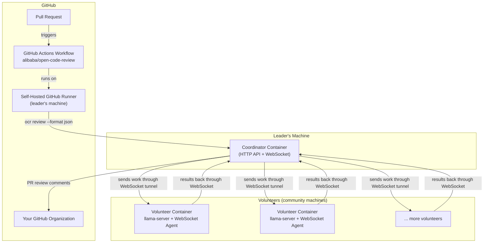

# Community Code Review

> Community-powered AI code reviews for this GitHub organization.

## How It Works



1. A PR is opened in any organization repository.
2. The GitHub Actions workflow (running on the **self-hosted runner**) invokes `ocr review`.
3. `ocr` sends the diff to the **Coordinator** (OpenAI-compatible API endpoint).
4. The Coordinator sends the inference request through a **volunteer's persistent outbound WebSocket tunnel**.
5. The Volunteer runs the model (Qwen3-30B-A3B GGUF) via `llama-server`, returns results through the same tunnel.
6. The Coordinator sends the review back to `ocr`, which posts inline PR comments.

## Repository Structure

```
community-code-review/
├── README.md                    ← This file
├── ARCHITECTURE.md              ← Full architecture & design decisions
├── setup.sh                    ← One-command setup (Git Bash / Linux / macOS)
├── teardown.sh                 ← Cleanup script (Git Bash / Linux / macOS)
├── coordinator/                 ← Coordinator Docker image (relay server)
│   ├── Dockerfile
│   ├── requirements.txt
│   └── server.py
├── volunteer/                   ← Volunteer Docker image (llama-server + agent)
│   ├── Dockerfile
│   ├── entrypoint.sh
│   └── requirements.txt
├── docs/
│   ├── LEADER_SETUP.md          ← How the leader sets everything up
│   ├── VOLUNTEER_SETUP.md       ← How volunteers join the network
│   └── GITHUB_ACTIONS_SETUP.md  ← How to configure the workflow per repo
├── .env.example                ← Template for environment variables
└── docker-compose.yml          ← Orchestrates coordinator + runner
```

## Quick Links

- [Architecture Overview](ARCHITECTURE.md)
- [Leader Setup Guide](docs/LEADER_SETUP.md)
- [Volunteer Setup Guide](docs/VOLUNTEER_SETUP.md)
- [GitHub Actions Configuration](docs/GITHUB_ACTIONS_SETUP.md)

## License

MIT — for the community code review infrastructure.


<!-- test trigger --> ZagatoZee Woz 'ere
