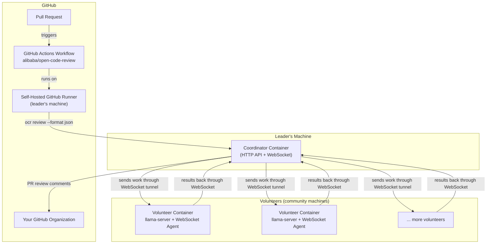

# Community Code Review

> Community-powered AI code reviews for this GitHub organization.

## How It Works



1. A PR is opened in any organization repository.
2. The GitHub Actions workflow (running on the **self-hosted runner**) invokes `ocr review`.
3. `ocr` sends the diff to the **Coordinator** (OpenAI-compatible API endpoint).
4. The Coordinator sends the inference request through a **volunteer's persistent outbound WebSocket tunnel**.
5. The Volunteer runs the model (Qwen3-30B-A3B GGUF) via `llama-server`, returns results through the same tunnel.
6. The Coordinator sends the review back to `ocr`, which posts inline PR comments.

## Repository Structure

```
community-code-review/
├── README.md                    ← This file
├── ARCHITECTURE.md              ← Full architecture & design decisions
├── LICENSE.md                   ← MIT License
├── setup.sh                     ← One-command setup (Git Bash / Linux / macOS)
├── teardown.sh                  ← Cleanup script (Git Bash / Linux / macOS)
├── scripts/
│   └── test.sh                  ← Integration test (deterministic, CI-ready)
├── tests/
│   └── test_agent_state_machine.py  ← Unit tests for volunteer state machine
├── coordinator/                 ← Coordinator Docker image (relay server)
│   ├── .dockerignore
│   ├── Dockerfile
│   ├── requirements.txt
│   └── server.py
├── volunteer/                   ← Volunteer Docker image (llama-server + agent)
│   ├── .dockerignore
│   ├── Dockerfile
│   ├── entrypoint.sh
│   ├── agent.py                 ← WebSocket agent + model lifecycle manager
│   ├── MODEL_README.md          ← Info left alongside downloaded models
│   └── requirements.txt
├── docs/
│   ├── LEADER_SETUP.md          ← How the leader sets everything up
│   ├── VOLUNTEER_SETUP.md       ← How volunteers join the network
│   └── GITHUB_ACTION.md         ← How to configure the workflow per repo
├── workflows/
│   └── ocr-review.yml           ← Source OCR workflow (deployed to target repos)
├── .env.example                 ← Template for environment variables
├── .github/
│   └── workflows/
│       ├── build-coordinator.yml      ← CI: builds and publishes coordinator image
│       ├── build-volunteer.yml        ← CI: builds and publishes volunteer image
│       ├── deploy-ocr.yml             ← CI: deploys ocr-review.yml to org repos
│       ├── integration-test.yml       ← CI: runs scripts/test.sh on pushes/PRs
│       └── ocr-review.yml             ← CI: source workflow deployed to target repos
└── docker-compose.yml           ← Orchestrates coordinator + runner
```

## Quick Links

- [Architecture Overview](ARCHITECTURE.md)
- [Leader Setup Guide](docs/LEADER_SETUP.md)
- [Volunteer Setup Guide](docs/VOLUNTEER_SETUP.md)
- [GitHub Actions Configuration](docs/GITHUB_ACTION.md)

## Testing

A deterministic integration test is included that verifies the full coordinator → volunteer pipeline without requiring a GPU or downloading a model.

```bash
# Run the integration test (uses MOCK_MODE by default)
./scripts/test.sh
```

The test:
- Builds coordinator and volunteer images from source
- Spins up an isolated Docker network
- Verifies volunteer registration and metadata
- Sends a real inference request through the pipeline
- Cleans up all containers automatically

It runs automatically in CI on pushes and pull requests (see `.github/workflows/integration-test.yml`).

## Developing

### Minimum iteration cycle

After making changes to the volunteer agent, you can run just the unit tests
without rebuilding the Docker image or spinning up the coordinator:

```bash
# Build once (image only needs rebuilding when deps change)
docker build -t volunteer:test volunteer

# Run unit tests in the existing image (mounts current code)
docker run --rm --entrypoint python3 \
    -e COORDINATOR_URL="http://coordinator:8080" \
    -e MOCK_MODE=1 \
    -v "$(pwd)/tests/test_agent_state_machine.py:/app/test_agent_state_machine.py" \
    volunteer:test \
    -m pytest /app/test_agent_state_machine.py -v
```

To run the full integration test (coordinator + volunteer + mock inference):

```bash
# Clean up leftovers, then run
docker rm -f ccr-test-volunteer ccr-test-coordinator 2>/dev/null; \
docker network rm ccr-test-net 2>/dev/null; \
./scripts/test.sh
```

### What to touch

| File | Purpose |
|------|---------|
| `volunteer/agent.py` | Main agent logic — state machine, subprocess management, GPU polling |
| `volunteer/entrypoint.sh` | Container startup — model download, env exports |
| `coordinator/server.py` | Coordinator — volunteer scheduling, WebSocket relay |
| `tests/test_agent_state_machine.py` | Unit tests for the volunteer state machine |
| `scripts/test.sh` | Integration test — coordinator + volunteer pipeline |
| `ARCHITECTURE.md` | System design and state machine documentation |

### Workflow

1. Edit code in `volunteer/agent.py` or `coordinator/server.py`
2. Run unit tests (fast, < 1s): `docker run ... pytest ...` as above
3. Run integration test (~2-3 min): `./scripts/test.sh`
4. Commit with `git add -p` to isolate changes into coherent commits

## License

MIT — for the community code review infrastructure.